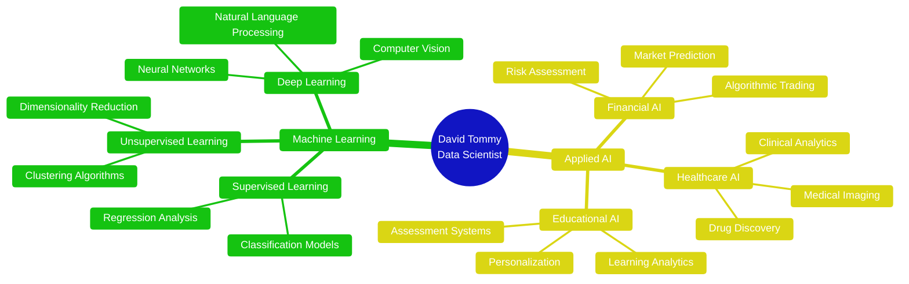

<!-- Glassmorphism Header -->
<div align="center">
  
</div>

<!-- Soft Gradient Banner -->
<div align="center">
  
</div>

<!-- Glassmorphism Divider -->
<div align="center">
  
</div>

# 🔮 DATA & AI SCIENTIST | MACHINE LEARNING ARCHITECT

<div align="center">

<!-- Glassmorphism Info Card -->


</div>


## 💫 **THE DATA SCIENTIST PROFILE**


<div align="left">

### ✨ **CORE EXPERTISE**

<div align="center">

<!-- Glassmorphism Profile Table -->
| 🏷️ | 💎 **SPECIALIZATION** |
|:---:|:---|
| 👨‍💻 | **David Tommy** |
| 🎭 | **Data & AI Scientist** |
| 🔬 | **Machine Learning** • **Deep Learning** • **Statistical Modeling** |
| 🐍 | **Python** • **R** • **SQL** • **C++** • **JavaScript** |
| 🤖 | **TensorFlow** • **PyTorch** • **Scikit-learn** • **Pandas** • **NumPy** |
| 📊 | **Jupyter** • **Apache Spark** • **Tableau** • **Power BI** |
| ☁️ | **Azure ML** • **AWS SageMaker** • **Docker** • **FastAPI** |
| 🎯 | **AI-Powered Learning Platform (FastAPI + Flutter)** |
| 💭 | ***"Turning Data into Decisions, Algorithms into Impact"*** |

</div>

</div>

<div align="center">
  
<!-- Soft Glassmorphism Badge -->


</div>

---

## 🌈 **DATA SCIENCE & AI TOOLKIT**

<div align="center">

<!-- Glassmorphism Tech Sections -->
<table>
<tr>
<td align="center">
<br>

</td>
<td align="center">
<br>

</td>
</tr>
<tr>
<td align="center">
<br>

</td>
<td align="center">
<br>

</td>
</tr>
</table>

</div>

<!-- Glassmorphism Skills Progress -->
<div align="center">

### 🎯 **EXPERTISE MATRIX**

| 🔬 **AI/ML DOMAIN** | 🌟 **MASTERY** | 📈 **YEARS** |
|:---:|:---:|:---:|
| **Machine Learning** |  | **6+ Years** |
| **Deep Learning** |  | **5+ Years** |
| **Data Analysis** |  | **7+ Years** |
| **Statistical Modeling** |  | **6+ Years** |
| **NLP & Computer Vision** |  | **4+ Years** |
| **MLOps & Deployment** |  | **3+ Years** |

</div>

---

## ✨ **CURRENT AI PROJECTS**

<div align="center">

<!-- Glassmorphism Project Cards -->
<table>
<tr>
<td width="50%" align="center">


<br>*FastAPI + Flutter + ML*

```yaml
🔧 Backend: FastAPI + PostgreSQL
📱 Frontend: Flutter (Cross-platform)
🤖 AI Features: 
   • Personalized Learning Paths
   • Progress Prediction Models
   • Content Recommendation Engine
   • Real-time Analytics Dashboard
🧠 ML Models: NLP, Collaborative Filtering
🚀 Status: Active Development
```

</td>
<td width="50%" align="center">


<br>*AI-Powered Market Analysis*

```yaml
📈 Data Sources: Multi-market feeds
🔬 ML Pipeline:
   • Time Series Forecasting
   • Sentiment Analysis (NLP)
   • Risk Assessment Models
   • Portfolio Optimization
⚡ Technologies: Python, TensorFlow, AWS
💹 Status: Live Trading
```

</td>
</tr>
<tr>
<td width="50%" align="center">


<br>*Enterprise Data Intelligence*

```yaml
🎯 Capabilities:
   • Customer Behavior Prediction
   • Demand Forecasting Models
   • Anomaly Detection Systems
   • Business Intelligence Dashboards
🛠️ Stack: Python, Spark, Azure ML
🚀 Status: Client Deployment
```

</td>
<td width="50%" align="center">


<br>*Healthcare Data Science*

```yaml
🧬 Research Areas:
   • Antimicrobial Resistance Prediction
   • Medical Image Analysis
   • Drug Discovery Acceleration
   • Clinical Decision Support
🔬 Tools: TensorFlow, PyTorch, R
🧪 Status: Research Phase
```

</td>
</tr>
</table>

</div>

---

## 🌸 **AI RESEARCH & SPECIALIZATIONS**

<div align="center">



</div>

### 🔮 **CORE ML SPECIALIZATIONS**

<div align="center">

  

  

</div>

- 📈 **Time Series Analysis** → Advanced forecasting models for financial & business data
- 🔍 **Computer Vision** → Image recognition, medical imaging, and visual AI systems  
- 📝 **Natural Language Processing** → Text analysis, sentiment analysis, and chatbot development
- 🎯 **Recommendation Systems** → Collaborative filtering and content-based recommendations
- 🚨 **Anomaly Detection** → Fraud detection, system monitoring, and outlier identification

### 🌺 **BIOMEDICAL AI RESEARCH**

<div align="center">

  

</div>

### 💼 **BUSINESS INTELLIGENCE**

<div align="center">

  

</div>

---

## 🌟 **DATA SCIENCE PERFORMANCE**

<div align="center">

<!-- Glassmorphism GitHub Stats -->


<!-- Languages with Glass Effect -->


<!-- Activity Graph Glass Style -->


</div>

---

## 🏆 **DATA SCIENCE ACHIEVEMENTS**

<div align="center">

<!-- Glass Trophy Display -->


<!-- Glassmorphism Achievement Badges -->
<table align="center">
<tr>
<td align="center" width="25%">

<br><sub>**ML Models Deployed**</sub>
</td>
<td align="center" width="25%">

<br><sub>**Datasets Analyzed**</sub>
</td>
<td align="center" width="25%">

<br><sub>**AI Research Projects**</sub>
</td>
<td align="center" width="25%">

<br><sub>**Custom Algorithms**</sub>
</td>
</tr>
</table>

</div>

---

## 🌐 **CONNECT WITH THE DATA SCIENTIST**

<div align="center">

<!-- Glassmorphism Social Links -->
<a href="https://discord.com/users/quantommy">
  
</a>
<a href="https://x.com/Dave_Tommx">
  
</a>
<a href="https://linkedin.com/">
  
</a>

<!-- Data Science Platforms with Glass Effect -->
<a href="#">
  
</a>
<a href="#">
  
</a>

<!-- Soft Visitor Counter -->


</div>

<!-- Glassmorphism ASCII Art -->
<div align="center">

```

```

</div>

<!-- Soft Gradient Footer -->
<div align="center">
  
</div>

<!-- Glassmorphism Easter Egg -->
<!--
    ✨🔮✨ GLASSMORPHISM DATA SCIENTIST ✨🔮✨
    Soft, translucent, and beautifully intelligent!
    Keep building those frosted glass algorithms! 💫
-->
