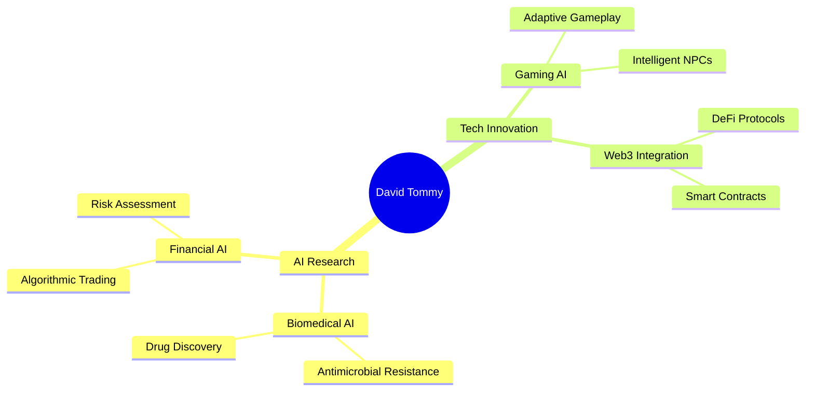

<!-- Dynamic Header with Typing Animation -->
<div align="center">
  
</div>


<!-- Glowing Divider -->
<div align="center">
  
</div>

# 🌟 DIGITAL ARCHITECT & AI VISIONARY

<div align="center">
  
```ascii
╔═══════════════════════════════════════════════════════════════╗
║  🚀 TRANSFORMING IDEAS INTO INTELLIGENT SYSTEMS              ║
║  💡 AI • DATA SCIENCE • TRADING BOTS • 3D ART • GAMES       ║
║  🎯 12+ YEARS OF INNOVATION • ∞ LINES OF CODE               ║
╚═══════════════════════════════════════════════════════════════╝
```

</div>

<!-- Matrix-style Animation -->
<div align="center">
  
</div>

---

## 🎭 **THE ARCHITECT BEHIND THE CODE**


<div align="center">

### 🎯 **DEVELOPER PROFILE**

| 🏷️ **ATTRIBUTE** | 💎 **VALUE** |
|:---|:---|
| 👨‍💻 **Name** | `David Tommy` |
| 🎭 **Role** | `AI Architect & Data Scientist` |
| 🗣️ **Languages** | `Python` • `R` • `C++` • `JavaScript` • `Dart` • `C#` |
| 🚀 **Expertise** | `AI/ML` • `Trading Bots` • `3D Animation` • `Full-Stack` |
| 🛠️ **Tools** | `TensorFlow` • `Firebase` • `Azure` • `Jupyter` • `Unity` |
| 🏗️ **Architecture** | `Microservices` • `Event-Driven` • `Serverless` |
| 🎯 **Current Focus** | `SkillQuest AI Platform` |
| 💭 **Motto** | **"Code • Create • Conquer"** |

</div>

<div align="center">
  
**🚀 Building tomorrow's tech today!**


</div>

<!-- Neon Tech Skills -->
## 🔥 **TECH ARSENAL**

<div align="center">

### ⚡ **CORE LANGUAGES**


### 🛠️ **FRAMEWORKS & TOOLS**


### 🎮 **CREATIVE & GAME DEV**


</div>

<!-- Animated Skills Matrix -->
<div align="center">

| 🎯 **SKILL DOMAIN** | 🔥 **MASTERY LEVEL** | 🚀 **EXPERIENCE** |
|:---:|:---:|:---:|
| **AI/ML Engineering** |  | 5+ Years |
| **Data Science** |  | 6+ Years |
| **Trading Bots** |  | 4+ Years |
| **Full-Stack Dev** |  | 8+ Years |
| **3D Animation** |  | 7+ Years |
| **Game Development** |  | 3+ Years |

</div>

---

## 🌈 **CURRENT UNIVERSE PROJECTS**

<div align="center">

<!-- Project Cards -->
<table>
<tr>
<td width="50%">

### 🎮 **SkillQuest AI**
*Gamified Learning Platform*

```yaml
Stack: Flutter + Firebase + AI
Features: 
  - XP/Ranking System
  - AI-Powered Learning
  - Social Competition
  - Real-time Analytics
Status: 🔥 In Development
```

</td>
<td width="50%">

### 🤖 **Quantum Trading Bots**
*AI-Powered Trading Systems*

```yaml
Markets: Forex + Crypto + Stocks
Technologies:
  - High-Frequency Trading
  - Machine Learning
  - Risk Management
  - Real-time Analytics
Status: 💰 Live & Profitable
```

</td>
</tr>
<tr>
<td width="50%">

### 🌐 **Developer Social Hub**
*AI-Enhanced Community Platform*

```yaml
Features:
  - AI Code Review
  - Smart Networking
  - Project Collaboration
  - Skill Matching
Status: 🚀 Beta Testing
```

</td>
<td width="50%">

### 🎨 **3D Crypto Art Studio**
*NFT & Meme Coin Visuals*

```yaml
Tools: Blender + Unity + AI
Output:
  - Animated NFTs
  - Crypto Visualizations
  - Interactive 3D Worlds
Status: ✨ Creating Magic
```

</td>
</tr>
</table>

</div>

---

## 🔬 **RESEARCH & INNOVATION LAB**

<div align="center">



</div>

### 🧬 **AI FOR LIFE SCIENCES**
- 🦠 **Antimicrobial Resistance** → AI models predicting drug resistance patterns
- 🧪 **Bioinformatics** → Genomic data analysis & protein folding predictions
- 💊 **Drug Discovery** → ML-accelerated compound screening

### 📈 **QUANTITATIVE FINANCE**
- 🤖 **Algorithmic Trading** → Multi-asset automated strategies
- 📊 **Risk Management** → AI-powered portfolio optimization
- 🔮 **Market Prediction** → Deep learning forecasting models

---

## 📊 **PERFORMANCE METRICS**

<div align="center">

<!-- GitHub Stats with Glow Effect -->


<!-- Languages with Glow -->


<!-- Activity Graph -->


<!-- Contribution Snake -->


</div>

---

## 🏆 **ACHIEVEMENT SHOWCASE**

<div align="center">

<!-- Trophy Display -->


<!-- Custom Achievements -->
<table align="center">
<tr>
<td align="center" width="25%">

<br><sub><b>AI Models Built</b></sub>
</td>
<td align="center" width="25%">

<br><sub><b>Trading Systems</b></sub>
</td>
<td align="center" width="25%">

<br><sub><b>Games Developed</b></sub>
</td>
<td align="center" width="25%">

<br><sub><b>Websites Created</b></sub>
</td>
</tr>
</table>

</div>

---

## 🌐 **CONNECT TO THE MATRIX**

<div align="center">

<!-- Social Links with Glow Effect -->
<a href="https://discord.com/users/quantommy">
  
</a>
<a href="https://x.com/Dave_Tommx">
  
</a>
<a href="https://linkedin.com/">
  
</a>

<!-- Visitor Counter with Style -->


</div>

<!-- Matrix Rain Effect ASCII -->
<div align="center">

```
    ╔═══════════════════════════════════════════════════════════════╗
    ║                    WELCOME TO THE MATRIX                      ║
    ║  ████████ █████████ █████████ █████████ █████████ █████████  ║
    ║  ██    ██ ██     ██ ██     ██ ██     ██ ██     ██ ██     ██  ║
    ║  ██ ██ ██ ██ ███ ██ ██ ███ ██ ██ ███ ██ ██ ███ ██ ██ ███ ██  ║
    ║  ██ ██ ██ ██ ███ ██ ██ ███ ██ ██ ███ ██ ██ ███ ██ ██ ███ ██  ║
    ║  ████████ █████████ █████████ █████████ █████████ █████████  ║
    ║                                                               ║
    ║              "THERE IS NO SPOON... ONLY CODE"                ║
    ╚═══════════════════════════════════════════════════════════════╝
```

</div>

<!-- Animated Footer -->
<div align="center">
  
</div>

<!-- Hidden Easter Egg -->
<!--
    ⠀⠀⠀⠀⠀⠀⠀⠀⢀⣀⣤⣤⣶⣶⣾⣿⣿⣿⣿⣷⣶⣶⣤⣤⣀⡀⠀⠀⠀⠀⠀⠀⠀⠀
    ⠀⠀⠀⠀⠀⢀⣤⣶⣿⣿⣿⣿⣿⣿⣿⣿⣿⣿⣿⣿⣿⣿⣿⣿⣿⣿⣶⣤⡀⠀⠀⠀⠀⠀
    ⠀⠀⠀⢀⣴⣿⣿⣿⣿⣿⣿⣿⣿⣿⣿⣿⣿⣿⣿⣿⣿⣿⣿⣿⣿⣿⣿⣿⣿⣦⡀⠀⠀⠀
    ⠀⠀⣰⣿⣿⣿⣿⣿⣿⣿⣿⣿⣿⣿⣿⣿⣿⣿⣿⣿⣿⣿⣿⣿⣿⣿⣿⣿⣿⣿⣿⣆⠀⠀
    ⠀⣸⣿⣿⣿⣿⣿⣿⣿⣿⣿⣿⣿⣿⣿⣿⣿⣿⣿⣿⣿⣿⣿⣿⣿⣿⣿⣿⣿⣿⣿⣿⣇⠀
    YOU FOUND THE SECRET! 🎉
    The matrix has many layers... keep exploring! 
-->
